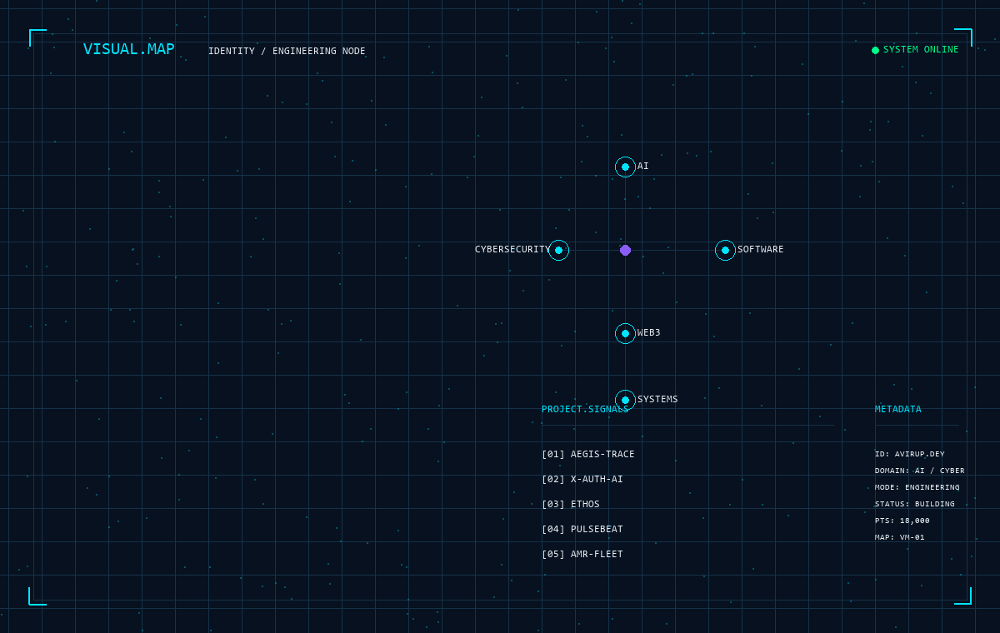

<div align="center">

# ⚡ AVIRUP DEY

### AI × CYBERSECURITY × SOFTWARE ENGINEERING

**Building intelligent systems, secure infrastructure & developer-focused solutions.**

<br>

[](https://github.com/avirupdey2006)
[](https://avirup-dey-portfolio.netlify.app/)

<br><br>



</div>

---

# ⚡ SYSTEM STATUS

<div align="center">

| STATUS | DOMAIN | MODE |
|:---:|:---:|:---:|
| 🟢 **BUILDING** | **AI · CYBERSECURITY · SOFTWARE** | **ENGINEERING** |

</div>

> **Mission:** Designing and building intelligent, secure and scalable software systems.

---

# 🧠 ABOUT ME

I am a **Computer Science & Engineering student and software developer** focused on building practical systems across **Artificial Intelligence, Cybersecurity, Full-Stack Engineering and emerging technologies**.

My projects explore the intersection of intelligent automation, secure software architecture, developer tooling, distributed systems and modern application engineering.

I enjoy taking complex technical problems, designing structured solutions and turning them into working software.

---

# 🛰️ ENGINEERING DOMAINS

| Domain | Focus |
|:---|:---|
| 🤖 **Artificial Intelligence** | Machine Learning · Intelligent Systems · AI Automation |
| 🛡️ **Cybersecurity** | Security Engineering · Digital Forensics · Zero Trust |
| 💻 **Software Engineering** | Backend · APIs · Full-Stack Applications |
| ⛓️ **Blockchain / Web3** | Smart Contracts · Zero-Knowledge Systems |
| 🚀 **Systems Engineering** | Distributed Systems · Communication · Architecture |
| 🧪 **Research & Experimentation** | Emerging Technologies · Technical Prototyping |

---

# 🛠️ TECHNOLOGY STACK

### Programming Languages

`Python` · `Java` · `JavaScript` · `TypeScript` · `C/C++` · `Solidity`

### Artificial Intelligence & Machine Learning

`PyTorch` · `ONNX` · `Machine Learning` · `LangGraph`

### Cybersecurity

`Kali Linux` · `Burp Suite` · `Hashcat` · `Digital Forensics` · `Zero Trust`

### Web & Backend Engineering

`React` · `Angular` · `Node.js` · `Spring Boot` · `FastAPI`

### Blockchain & Web3

`Solidity` · `Hardhat` · `Circom` · `Zero-Knowledge`

### Infrastructure & Development Tools

`Docker` · `Git` · `GitHub Actions` · `MQTT` · `AWS`

---

# 🔬 FEATURED SYSTEMS

## 🛡️ Aegis-Trace

**Autonomous Cyber Forensics & Zero-Trust Investigation System**

An intelligent cybersecurity architecture designed around autonomous investigation workflows, security analysis and tamper-evident evidence handling.

**Core Technologies:** `Python` · `LangGraph` · `Blockchain` · `Zero Trust`

---

## 🤖 X-Auth-AI

**Credential Intelligence & Security Analysis Engine**

A security-oriented intelligent system focused on credential analysis and authentication-security workflows.

**Core Technologies:** `Python` · `Kali Linux` · `Burp Suite` · `Hashcat`

---

## 📈 PulseBeat

**Market Data Ingestion & Analytics Pipeline**

A market-data engineering system designed for collecting, processing, storing and analysing financial market information.

**Core Technologies:** `Python` · `yfinance` · `SQLite`

---

## 🔐 Ethos

**Blockchain & Zero-Knowledge Architecture**

An experimental Web3 system exploring smart-contract infrastructure and zero-knowledge circuit design.

**Core Technologies:** `Solidity` · `Hardhat` · `Circom` · `ZK`

---

## 🚚 AMR Fleet

**Multi-Agent Autonomous Robot Fleet Simulation**

A software-based autonomous mobile robot fleet simulation focused on communication, security, anomaly detection, conflict prediction and space-time planning.

**Core Technologies:** `Python` · `PyTorch` · `ONNX` · `MQTT` · `FastAPI` · `React`

---

# 🚧 CURRENTLY BUILDING

```text

[01] SONIC VISION AI
     Intelligent Food Distribution Platform

[03] AMR FLEET
     Multi-Agent Autonomous Robot Fleet Simulation

[04] AI SECURITY RESEARCH
     Intelligent Security Automation & Analysis
---

```

# 🗺️ SYSTEM ARCHITECTURE

> **Architecture visualization is actively running in the VISUAL.MAP terminal at the top of this profile.**

---

---

# 📡 ENGINEERING ACTIVITY

```text
┌──────────────────────────────────────────────────────────────┐
│                                                              │
│                     ENGINEERING ACTIVITY                     │
│                                                              │
│   AI / MACHINE LEARNING          ● ACTIVE                    │
│   CYBERSECURITY                  ● ACTIVE                    │
│   SOFTWARE ENGINEERING           ● ACTIVE                    │
│   BLOCKCHAIN / WEB3              ● ACTIVE                    │
│   SYSTEM DESIGN                  ● ACTIVE                    │
│                                                              │
└──────────────────────────────────────────────────────────────┘
```

> A data-driven activity visualization will be integrated here later.
# 📊 ENGINEERING METRICS

<div align="center">

| METRIC | STATUS |
|:---:|:---:|
| 🗂️ PUBLIC REPOSITORIES | **LIVE DATA — COMING SOON** |
| 💻 CONTRIBUTIONS | **LIVE DATA — COMING SOON** |
| ⭐ STARS | **LIVE DATA — COMING SOON** |
| 🧩 TECHNOLOGIES | **LIVE DATA — COMING SOON** |

---

# ⚙️ DEVELOPMENT PHILOSOPHY

```text
                    ┌─────────────┐
                    │   DISCOVER  │
                    └──────┬──────┘
                           │
                           ▼
                    ┌─────────────┐
                    │  UNDERSTAND │
                    └──────┬──────┘
                           │
                           ▼
                    ┌─────────────┐
                    │  ARCHITECT  │
                    └──────┬──────┘
                           │
                           ▼
                    ┌─────────────┐
                    │    BUILD    │
                    └──────┬──────┘
                           │
                           ▼
                    ┌─────────────┐
                    │     TEST    │
                    └──────┬──────┘
                           │
                           ▼
                    ┌─────────────┐
                    │    SECURE   │
                    └──────┬──────┘
                           │
                           ▼
                    ┌─────────────┐
                    │   DEPLOY    │
                    └──────┬──────┘
                           │
                           ▼
                    ┌─────────────┐
                    │   ITERATE   │
                    └─────────────┘
```

> **Build systems that solve problems.  
> Make them secure.  
> Make them useful.  
> Keep improving them.**

---

# 🌐 CONNECT

<div align="center">

[](https://github.com/avirupdey2006)

[](https://avirup-dey-portfolio.netlify.app/)

<br>

### `BUILD • BREAK • LEARN • REBUILD`

</div>

---

<div align="center">

`SYSTEM ONLINE`

</div>

</div>

> GitHub statistics and activity visualizations will be integrated into this section later.
